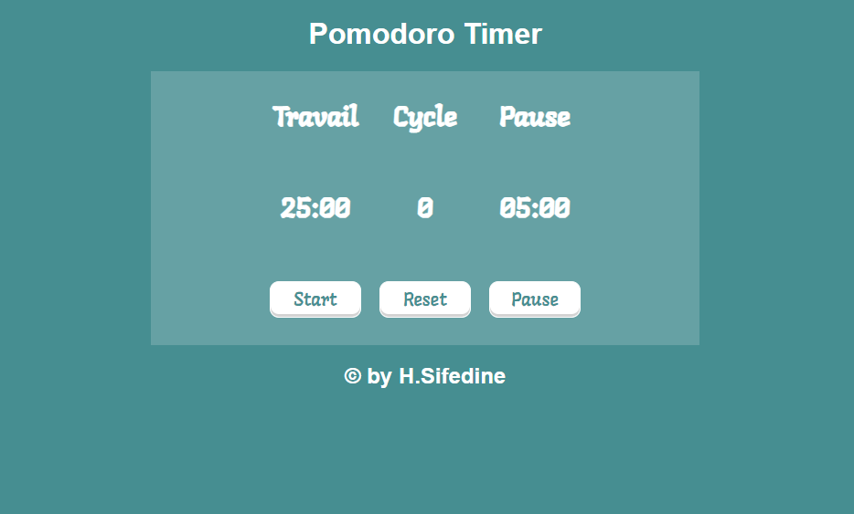

# Pomodoro-Timer :clock:

  

## Website Link

[Pomodoro Timer](https://sifedine-hajji.github.io/Pomodoro-Timer/)

## Project infos 

- **Type of challenge**: frontend review
- **Duration**: 1 day
- **Deadline**: none

## What is this project about :grey_question:

This is a web development exercise carried out with the BECODE training to recap various learned aspects and coding HTML CSS & Javascript techniques that we saw.

## Objectif

- create a Pomodoro Timer

### Pre-requisite :bowtie:

What you need to get started ...

- basics in **HTML**
- basics in **CSS**
- basics in **JavaScript** 

## visual :
